# 🚀 HireIQ - AI-Powered Career Intelligence Platform

**HireIQ** is a next-generation career intelligence application that helps job seekers analyze their resumes, discover matching job opportunities, and receive personalized career advice powered by AI.

---

## ✨ Features

### 🔐 Authentication System
- **Secure Login/Signup**: Cyberpunk-themed authentication interface
- **User Session Management**: Persistent login sessions
- **Default Admin Account**: Username: `admin`, Password: `123`

### 📄 Resume Analyzer
- **Multi-Format Support**: Upload PDF or DOCX resumes
- **AI Skill Extraction**: Automatically identifies 100+ technical and soft skills
- **Resume Scoring**: Get a comprehensive score (0-100) with detailed feedback
- **Actionable Insights**: Receive strengths and improvement suggestions
- **Experience Detection**: Automatically extracts years of experience and education

### 🔍 Smart Job Search
- **Skill-Based Matching**: Find jobs that align with your resume skills
- **Advanced Filters**:
  - Location (City/State/Remote)
  - Salary range ($30k-$200k)
  - Experience level (Junior/Mid/Senior)
  - Job type (Full-time/Part-time/Contract/Internship)
  - Date posted (Last week/month/3 months)
  - Company size (Startup to Enterprise)
- **Job Recommendations**: AI-ranked jobs with match percentage
- **Save & Track Jobs**: Bookmark jobs and track application status
- **Job Comparison Tool**: Compare multiple jobs side-by-side
- **Interview Preparation**: Get tailored interview prep guides for each job

### 🧭 Career Advisor
- **Personalized Career Paths**: Discover career trajectories based on your profile
- **Skill Development Plans**: Short, medium, and long-term skill roadmaps
- **Learning Resources**: Curated courses, books, and certifications
- **Industry Trends**: Stay updated with market demands
- **Work Preferences**: Customize advice based on your work-life balance needs

### 📊 Dashboard & Insights
- **Career Analytics**: Visual insights into your job search
- **Skill Gap Analysis**: Radar charts showing your skills vs. market demands
- **Salary Trends**: Understand salary distributions in your field
- **Job Market Trends**: Track hiring trends over time
- **Top Companies**: See companies with the best match scores

---

## 🛠️ Technology Stack

### Core Technologies
- **Python 3.8+**: Primary programming language
- **Streamlit**: Web application framework
- **Pandas**: Data manipulation and analysis
- **Matplotlib & Plotly**: Data visualization
- **NumPy**: Numerical computing

### Document Processing
- **PyPDF2**: PDF text extraction
- **docx2txt**: DOCX text extraction

### UI/UX
- **Custom CSS**: Cyberpunk-themed dark mode interface
- **Responsive Design**: Mobile and desktop compatible
- **Interactive Charts**: Plotly Express & Graph Objects

---

## 📦 Installation

### Prerequisites
- Python 3.8 or higher
- pip package manager

### Step 1: Clone the Repository
```bash
git clone https://github.com/yourusername/hireiq.git
cd hireiq
```

### Step 2: Create Virtual Environment (Recommended)
```bash
# Windows
python -m venv venv
venv\Scripts\activate

# macOS/Linux
python3 -m venv venv
source venv/bin/activate
```

### Step 3: Install Dependencies
```bash
pip install -r requirements.txt
```

### Step 4: Create `requirements.txt`
If not included, create a file named `requirements.txt` with:
```
streamlit==1.28.0
pandas==2.0.3
PyPDF2==3.0.1
docx2txt==0.8
matplotlib==3.7.2
plotly==5.17.0
numpy==1.24.3
```

### Step 5: Create `style.css` (Optional)
Create an empty `style.css` file in the project root or add custom styles:
```bash
touch style.css
```

---

## 🚀 Running the Application

### Start the Application
```bash
streamlit run app.py
```

### Access the Application
- The app will automatically open in your browser at `http://localhost:8501`
- Default login credentials:
  - **Username**: `admin`
  - **Password**: `123`

---

## 📖 User Guide

### Getting Started

#### 1. **Login or Sign Up**
- Use default credentials or create a new account
- Your session persists until you logout

#### 2. **Upload Your Resume**
- Navigate to **Resume Analyzer** tab
- Upload PDF or DOCX format resume
- Wait for AI analysis to complete

#### 3. **Review Resume Feedback**
- Check your resume score (0-100)
- Review extracted skills
- Read personalized improvement suggestions

#### 4. **Search for Jobs**
- Go to **Job Search** tab
- Select skills to prioritize
- Apply filters (location, salary, etc.)
- Click **Find Jobs** to get recommendations

#### 5. **Explore Job Matches**
- View jobs ranked by match percentage
- Compare multiple jobs side-by-side
- Save jobs for later review
- Access interview preparation guides

#### 6. **Get Career Advice**
- Visit **Career Advisor** tab
- Enter your career goals
- Set work preferences
- Generate personalized advice

#### 7. **Track Your Progress**
- Check **Dashboard & Insights** tab
- View analytics and trends
- Monitor skill gaps
- Track saved jobs and applications

---

## 🎨 Features in Detail

### Resume Analyzer Bot
- **Skill Categories Detected**:
  - Programming Languages (Python, Java, JavaScript, etc.)
  - Frameworks & Libraries (React, Django, TensorFlow, etc.)
  - Cloud & DevOps (AWS, Docker, Kubernetes, etc.)
  - Databases (MySQL, MongoDB, PostgreSQL, etc.)
  - Soft Skills (Communication, Leadership, etc.)
  - 100+ skills in total

### Job Search Bot
- **Match Algorithm**: Weighted scoring based on:
  - Percentage of job requirements you meet
  - Your skill coverage
  - Experience level alignment
  - Location preferences

### Interview Preparation
- **5 Comprehensive Sections**:
  1. Key Skills Review
  2. Common Interview Questions
  3. Technical Preparation
  4. Company Research Guide
  5. Strength Highlighting with STAR Method

### Dashboard Analytics
- **Visual Components**:
  - Job Type Distribution (Donut Chart)
  - Salary Trends (Bar Chart)
  - Skill Gap Analysis (Radar Chart)
  - Market Trends (Area Chart)
  - Top Companies Table

---

## 🔧 Configuration

### Customizing the App

#### Modify Skill Database
Edit the `extract_skills()` function in the code to add/remove skills:
```python
common_skills = [
    "Your", "Custom", "Skills", "Here"
]
```

#### Update Mock Job Data
Modify the `search_jobs()` function to integrate with real job APIs:
```python
# Replace mock_jobs with API calls
jobs = api.search_jobs(query, location)
```

#### Change Color Scheme
Edit the CSS styling in the code or `style.css` file

---

## 🤝 Contributing

We welcome contributions! Here's how you can help:

1. **Fork the repository**
2. **Create a feature branch**: `git checkout -b feature/AmazingFeature`
3. **Commit your changes**: `git commit -m 'Add AmazingFeature'`
4. **Push to the branch**: `git push origin feature/AmazingFeature`
5. **Open a Pull Request**

### Development Guidelines
- Follow PEP 8 style guidelines
- Add comments for complex logic
- Test thoroughly before submitting
- Update documentation as needed

---

## 📝 Known Limitations

- **Mock Data**: Job listings are currently mock data (API integration needed)
- **Email Feature**: Email functionality is simulated (requires SMTP setup)
- **Skill Extraction**: Uses keyword matching (could be enhanced with NLP)
- **Session Storage**: User data stored in session state (not persistent across restarts)

---

## 🔮 Future Enhancements

- [ ] Integration with real job APIs (Indeed, LinkedIn, Glassdoor)
- [ ] Advanced NLP for resume parsing
- [ ] Cover letter generator
- [ ] Resume builder/editor
- [ ] Database integration for persistent storage
- [ ] Email notifications for job alerts
- [ ] LinkedIn profile import
- [ ] Salary negotiation advisor
- [ ] Interview simulation with AI
- [ ] Mobile app version

---

## 📄 License

This project is licensed under the MIT License - see the [LICENSE](LICENSE) file for details.

---

## 👥 Authors

- **priyesh kawle** - *Initial Development* - [priyeshkawle-XFOX](https://github.com/priyeshkawle-XFOX)

---

## 🙏 Acknowledgments

- Streamlit for the amazing framework
- The open-source community for various libraries
- All contributors and testers

---

## 📞 Support

- **Issues**: [GitHub Issues](https://github.com/priyeshkawle-XFOX/hireiq/issues)
- **Email**: support@hireiq.example.com
- **Documentation**: [Wiki](https://github.com/priyeshkawle-XFOX/hireiq/wiki)

---

## ⭐ Star the Project

If you find HireIQ helpful, please give it a star on GitHub! It helps others discover the project.

---

**Made with ❤️ by the HireIQ Team**

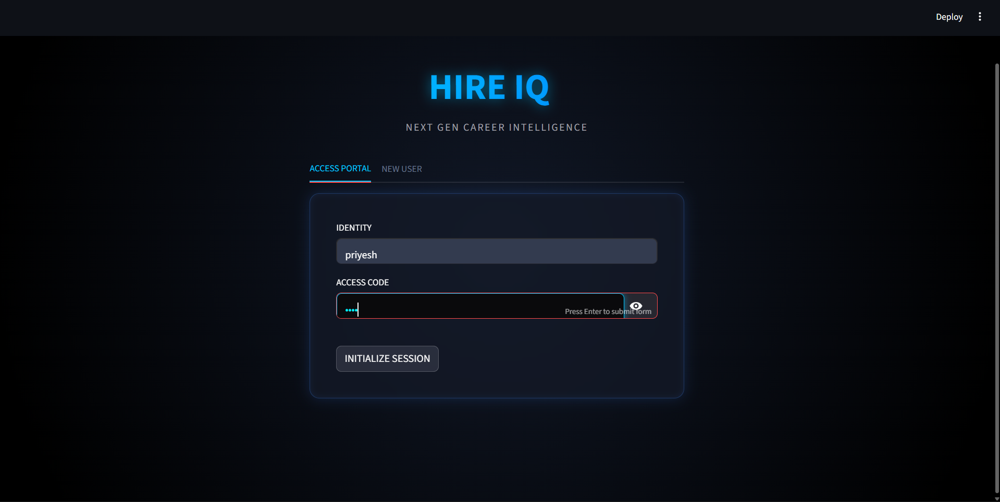
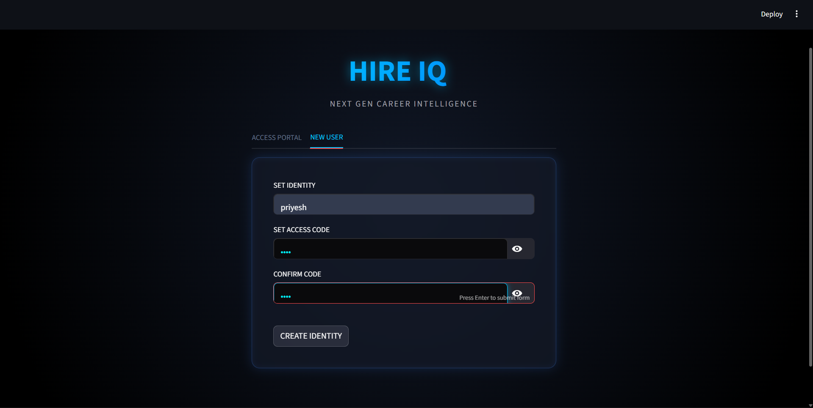
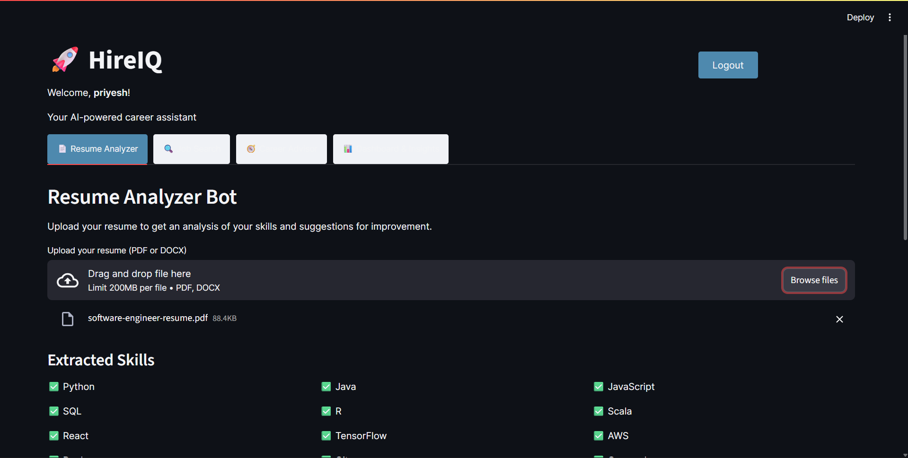
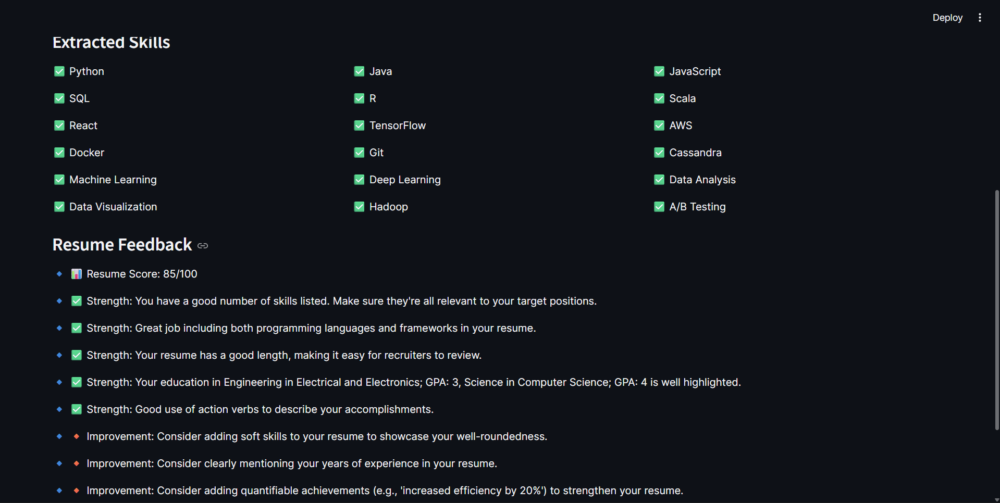
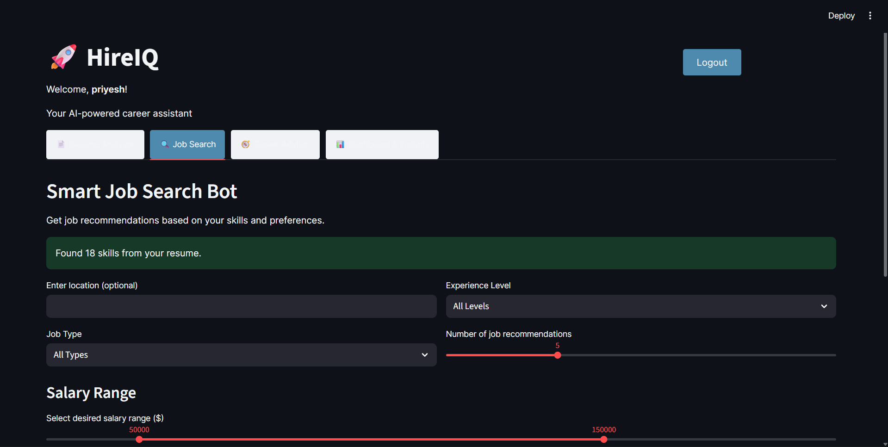
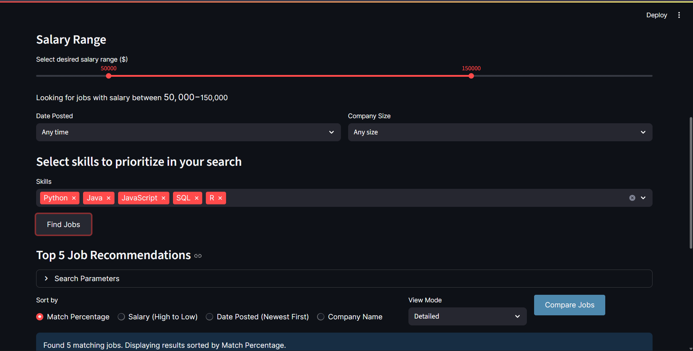
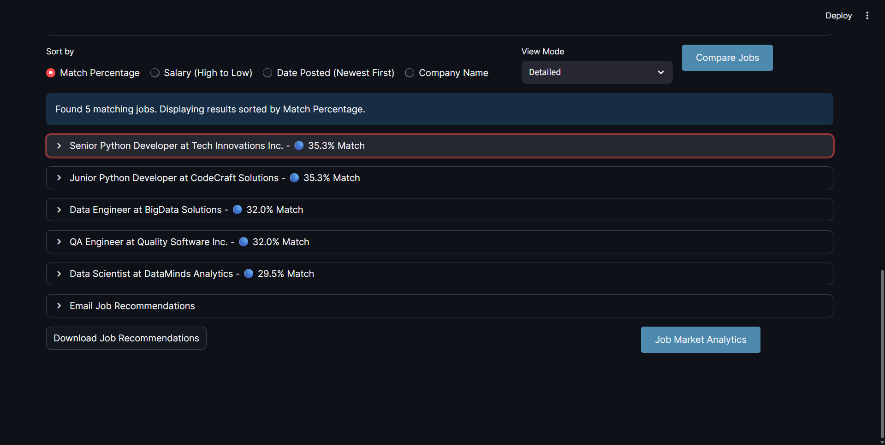
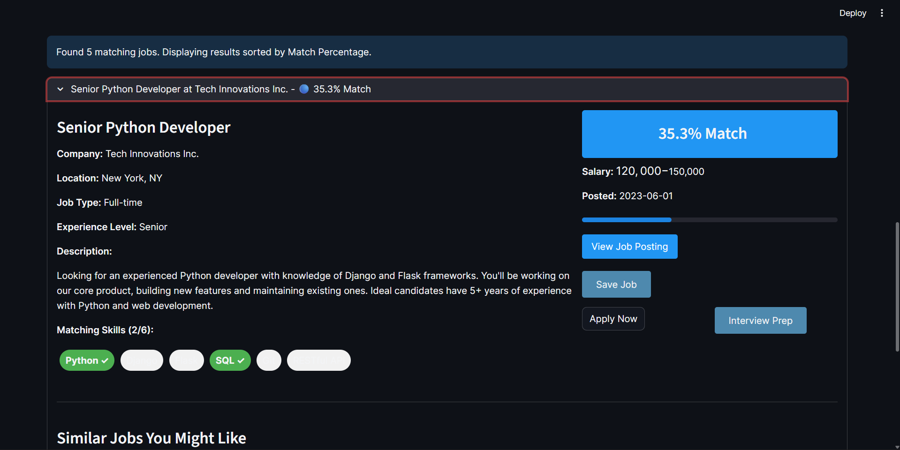
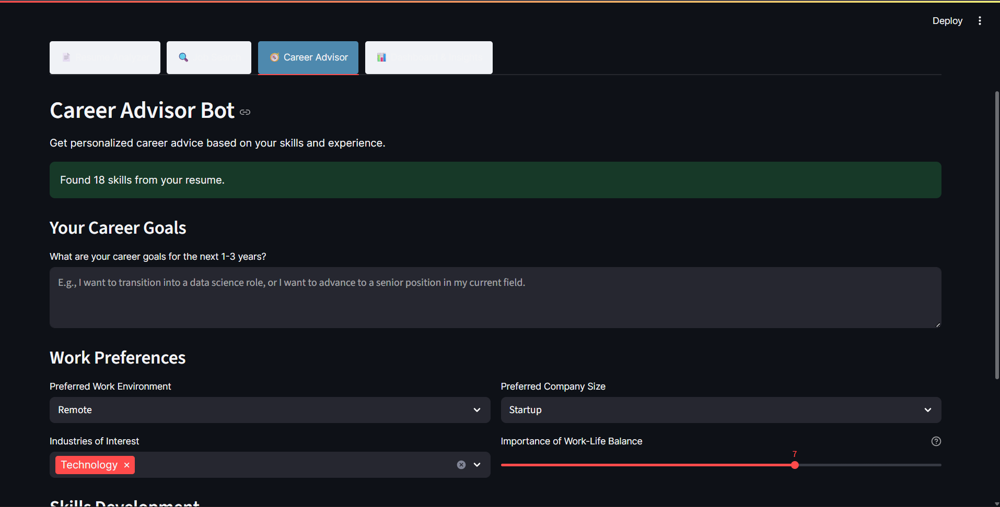
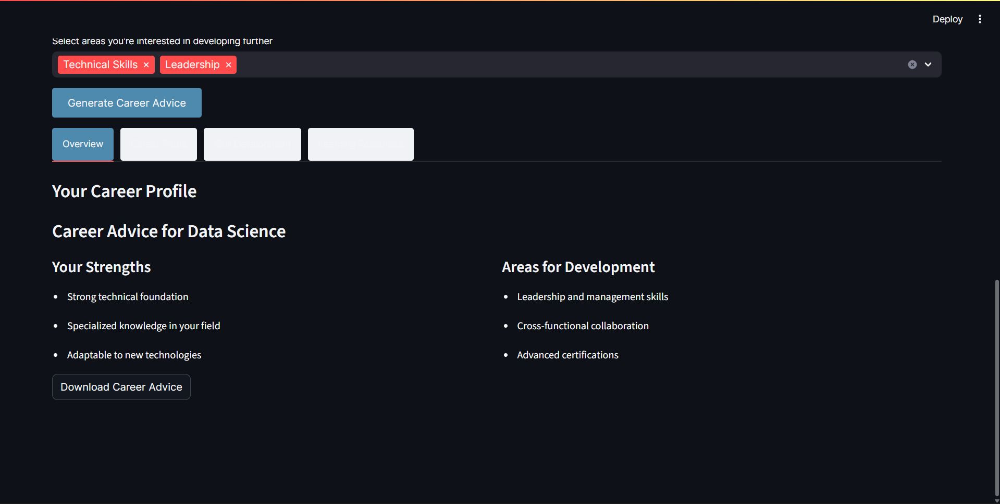

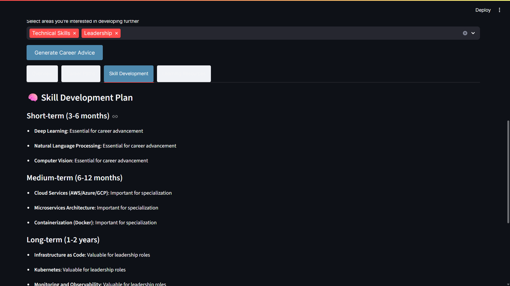
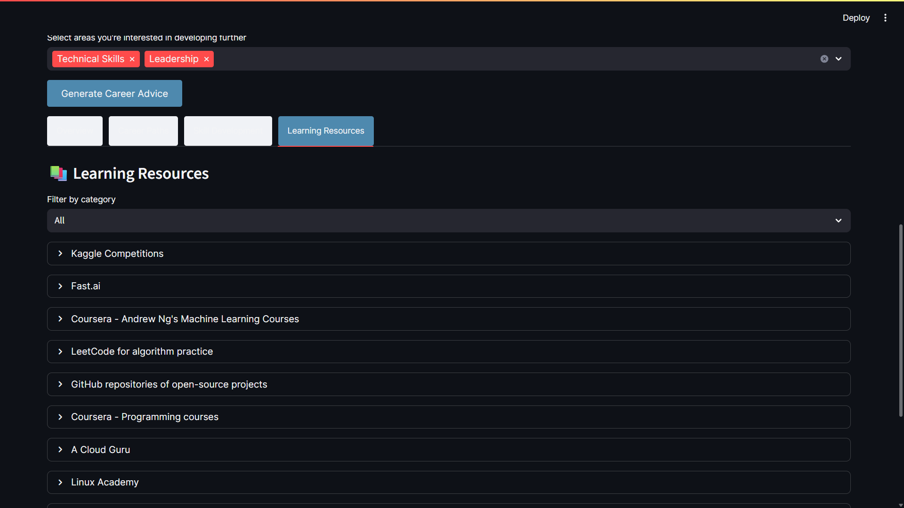
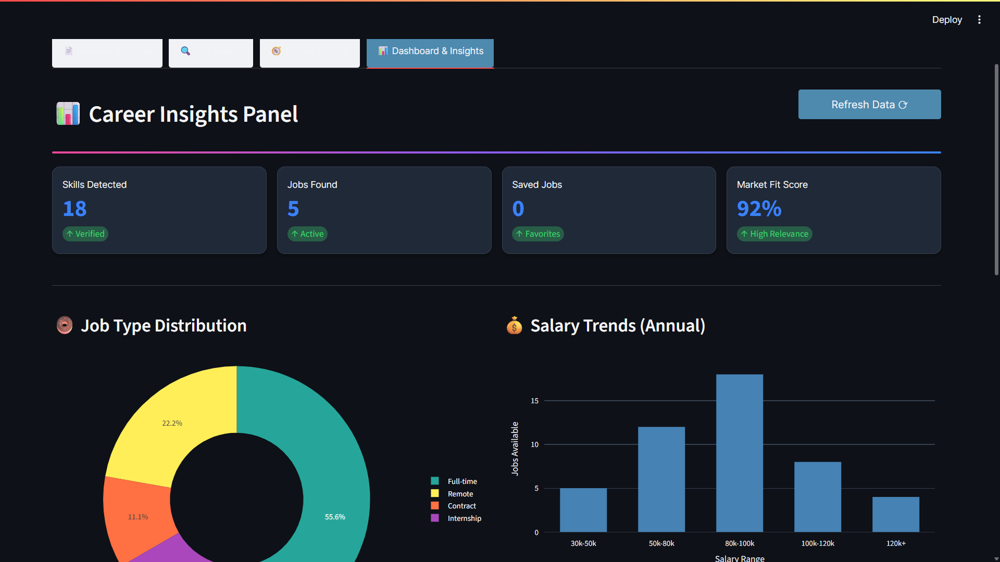
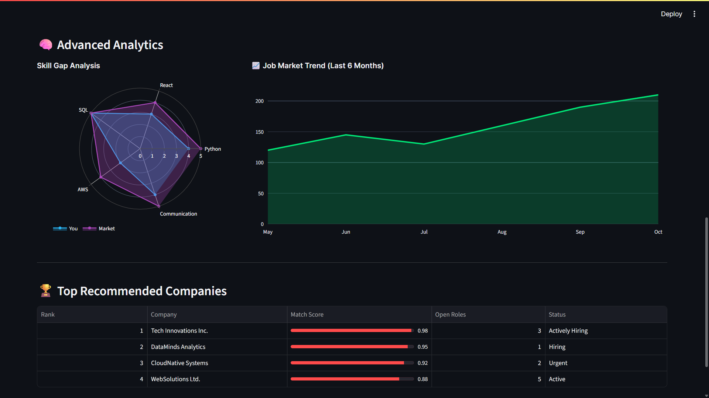